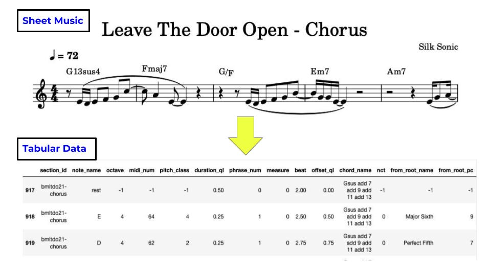
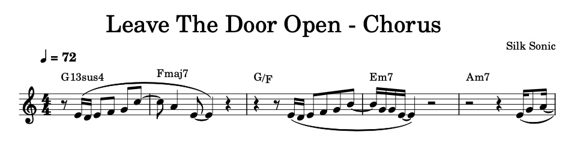
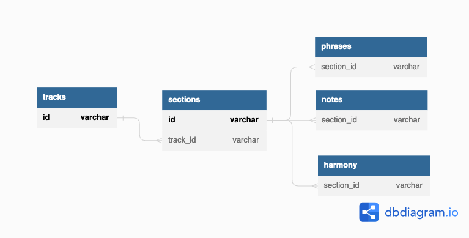

# musetable

musetable provides a way of turning musical scores into tabular data, allowing for an in-depth and unique analysis of the music.



It was born from my curiosity about some of the songs in my Spotify Top Songs of 2022 playlist, and desiring high quality, customized music data that simply isn't available.  I created transcriptions of the songs, and used musetable to help me analyze them as part musician, part data analyst.

Click here (add link later) to see my analysis.

# data pipeline

There are 4 steps to the musetable data pipeline:
  1. **create** a musical score
  2. **save** as a MusicXML (.mxl) file
  3. **transform** the .mxl file into tabular data
  4. **load** the data into either a PostgreSQL RDBMS or Google BigQuery

## create a score
Notation software such as the open source MuseScore makes it easy and fast to create a score.  Currently, musetable only accepts lead-sheet type scores, meaning the score should consist of a single melody line with accompanying chord symbols, like so:



Two notes about creating the score in order to get the most out of musetable:
  1. Slurs are used to denote musical phrases, which can be thought of as a group of notes to make a kind of musical sentence.  Avoid using slurs to indicate legato or performance instructions.  However, tieing notes is ok.
  2. One score should be one section of a piece.  For example, if a piece called Cool Song has a verse, pre-chorus, chorus, and bridge, four separate scores would be needed for that piece, with titles like "Cool Song - Verse".  I plan to change this with a future version of musetable that would accept a complete score.

## save as a MusicXML file
MusicXML files are a type of xml file format for storing Western music notation.  Although less common than midi file format, MusicXML includes important information about the score, such as chord symbols.  It's possible to export MusicXML files directly from music notation software.

## transform the .mxl file
I used the music21 python library to transform the data into a format that could be inserted into the following tables.



- tracks: contains information about the whole track, such as artist, year released, etc.
- sections: contains information about a single section, such as tempo, duration, etc.
- phrases: start and end location of each phrase in a section
- notes: contains information about each note, such as note name, duration, location, etc.
- harmony: contains information about the chord symbols, such as chord name, pitches, etc.

## load the data
musetable allows functionality with PostgreSQL and Google BigQuery

### PostgreSQL
Here are the main modules inside the `musetable` package:
- db_control_super.py - create and delete databases and users
- db_control.py - create and delete tables
- insert.py - using the file_to_sql() method, transform a MusicXML file and insert it into the database

### Google BigQuery
Here are the main modules inside the `musetable_gcp` package:
- gcloud_storage.py - create buckets and upload files
- bigquery.py - create datasets and tables, and insert data using MusicXML files stored either locally or in google cloud storage

### Automate ETL pipeline in gcp using Cloud Functions
The `musetable_ETL_function` package can be deployed to Google Cloud Functions.  When a new file is added to the specified bucket, it sends a trigger to the function and automatically does the following:
1. The function extracts the newly added file
2. The file is transformed into tabular data
3. The transformed data is loaded into Google BigQuery

After a) using the bigquery.py module to create a musetable dataset, b) creating a bucket to store MusicXML files, and c) updating the variables for the bucket, project, and dataset in Makefile and const_cf.py, use the following command to deploy the musetable-ETL-function:
```
make cloud_functions_deploy
```

# tools used
- MuseScore: Music notation software for creating scores
- psycopg2: PostgreSQL database adapter for Python
- music21: Musicology tool for Python, allowing for CRUD operations on a variety of music based file formats
- Google Cloud Platform: Cloud computing services, in particular:
  - Google Cloud Storage: Data lake for storing raw data
  - Google Cloud Functions: Platform for building event-based micro services
  - Google BigQuery: Data warehouse optimized for data analytics

# future improvements
- allow for scores that have three staves - a melody, a bassline, and some kind of harmony / voicing part.
- allow for complete scores that have the different sections indicated on the score.  Use this to create a summary of the piece's form.
- create musetable_midi, which would allow for a less robust analysis, but would accept midi files instead of MusicXML files.
- make musetable_ETL_function more foolproof and easier to deploy
- make my 2022 tracks dataset available on Kaggle
- remove necessity of playlist.csv
